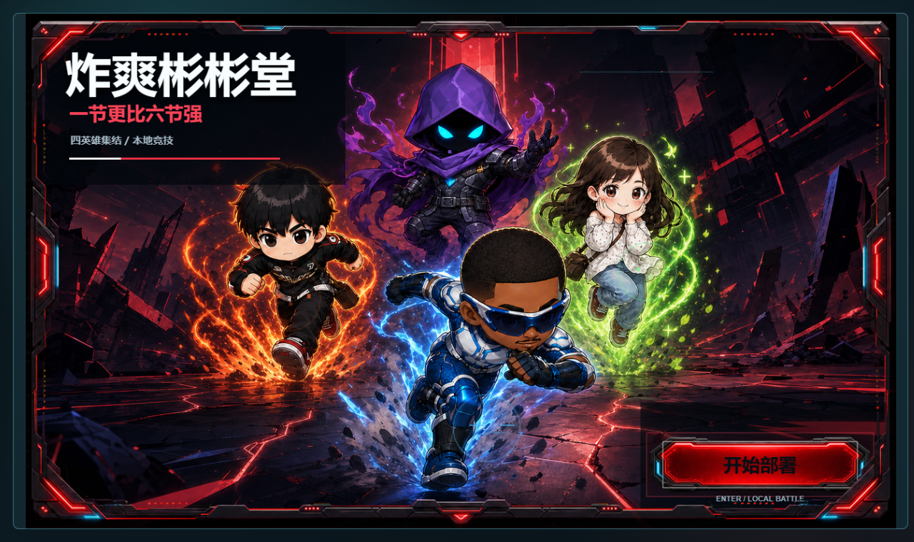
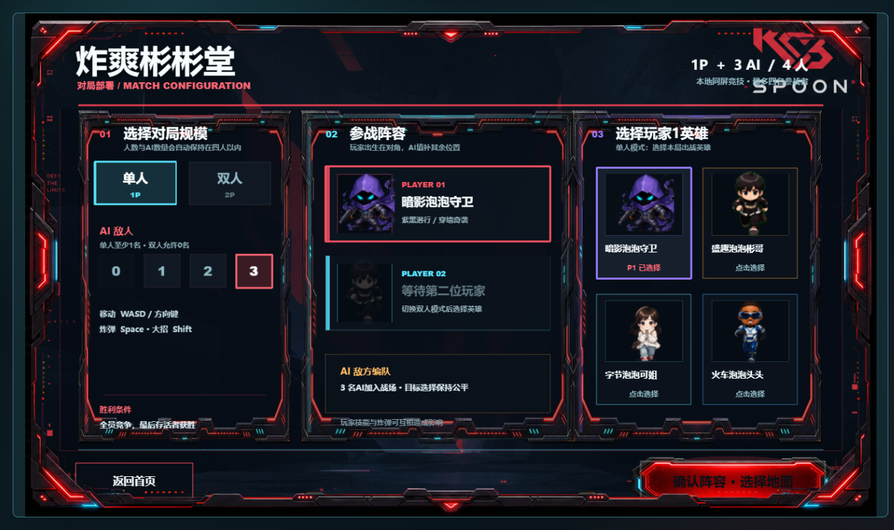
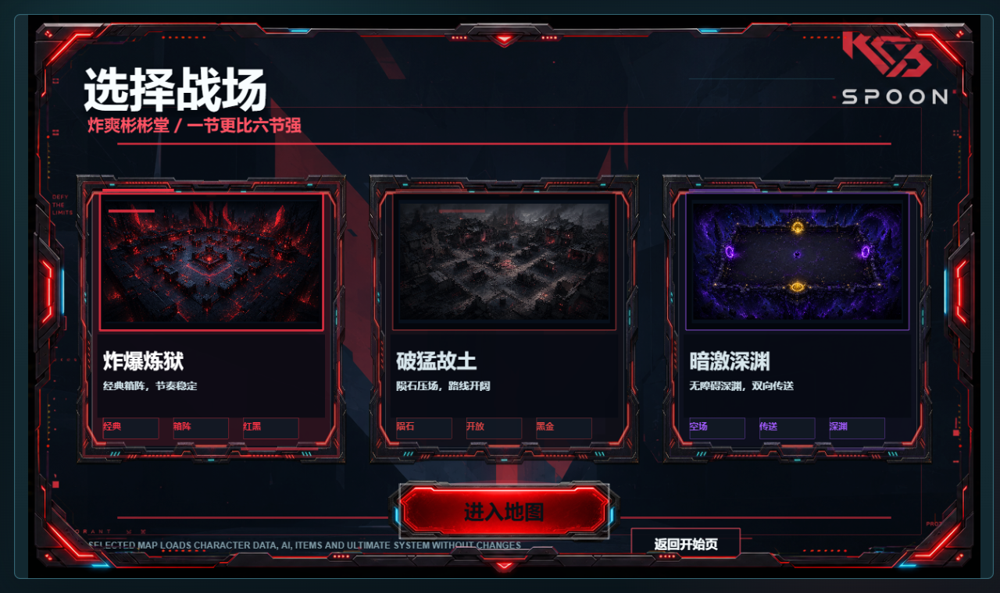
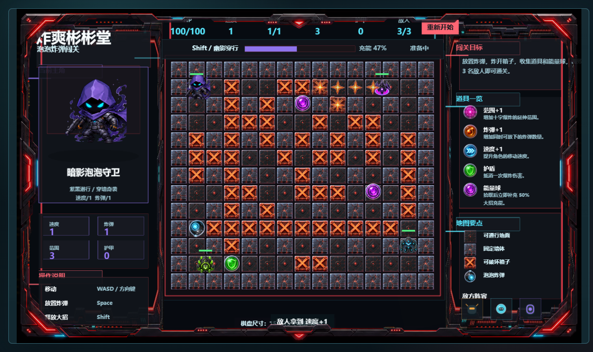
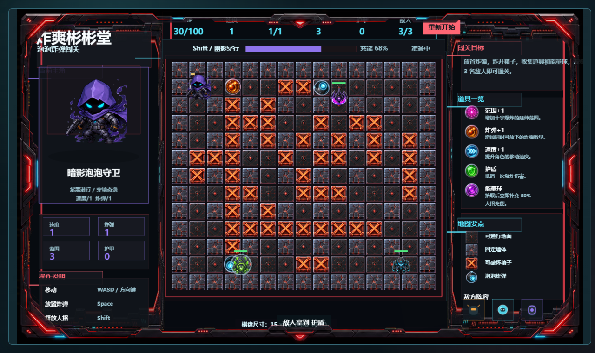
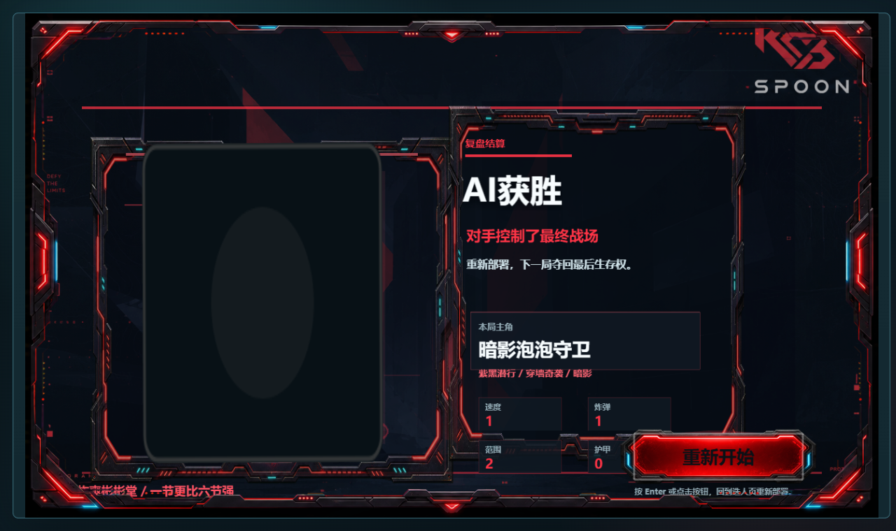

# 💣 炸爽彬彬堂 — Bubble Bomb Arena

**原创 2D 俯视角 Q 版泡泡炸弹对战游戏** — HTML5 + Phaser 3

> 选英雄、放炸弹、炸对手！4 位独特英雄 × 3 张风格各异的地图，支持单挑 AI 或本地双人对战。

---

## 🖼️ 游戏预览

### 🎬 开始画面



打开游戏，首先映入眼帘的是**酷炫的暗黑科技风主菜单**。标题「炸爽彬彬堂」醒目地展示在左上角，背景是精心绘制的角色群像。按 **Enter 键** 即可开始你的泡泡炸弹之旅。

---

### 🦸 英雄选择



在这里你可以从 **4 位风格迥异的英雄** 中选择一位出战：

| 英雄 | 大招 | 玩法风格 |
|------|------|----------|
| 🟣 **暗影泡泡守卫** | 幽影穿行 — 4.5 秒穿墙穿弹 | 绕后奇袭，神出鬼没 |
| 🟠 **盛趣泡泡彬哥** | 灼焰领域 — 9 秒火焰区域 | 范围压制，正面硬刚 |
| 🔵 **字节泡泡可姐** | 续命护场 — 5 秒无敌 | 极限生存，容错拉满 |
| 🔷 **火车泡泡头头** | 动力全开 — 4.5 秒三倍速 | 高速突进，无人能挡 |

选择英雄后，你还可以调整 **对手数量（1-3 个 AI）**，或者选择 **双人模式** 和好友在同一键盘上对战！

---

### 🗺️ 地图选择



三张地图，三种截然不同的战斗体验：

- 🔴 **炸爆炼狱** — 经典箱阵布局，节奏稳定。适合新手熟悉操作，也是高手博弈的公平竞技场。
- 🟤 **破猛故土** — 开阔路线 + 随机陨石坠落！不仅要防炸弹，还要时刻留意天上的火球。
- 🟣 **暗激深渊** — 无障碍空场 + 双向传送门 + 能量球随机刷新。节奏最快，操作空间最大！

每张地图都有自己独立的**视觉风格**（地板纹理、墙壁、炸弹、爆炸特效），让你每次换图都有新鲜感。

---

### 💥 游戏实况



游戏开始了！这是**15×13 的网格战场**：

- 🎯 **放置炸弹**：按 **空格键** 放置泡泡炸弹，炸弹会在 2.5 秒后爆炸
- 💨 **爆炸范围**：炸弹爆炸会沿着十字方向传播，可以摧毁木箱、波及敌人
- 📦 **破坏木箱**：炸开木箱有机会掉落道具——**范围+1、炸弹+1、速度+1、护盾**
- 🟢 **能量球**：地图上会定时刷新能量球，拾取可以积攒大招能量



**敌人的 AI 非常聪明**——它会：
1. 实时计算所有炸弹的爆炸范围
2. 发现自己处于危险区时，优先寻找最近的安全格逃离
3. 安全后才开始追击玩家、放置炸弹
4. 主动拾取能量球和道具来强化自己

所以千万别以为 AI 好欺负，它们是真的会**边跑边打、战术拉扯**！

---

### 🏆 结算画面



战斗结束！结算画面会清晰展示**胜负结果**、你的英雄英姿，以及本局的战斗数据统计。赢了就是爽，输了再来一局！

---

## 🚀 快速启动

### 方式 1（最推荐）：双击 `启动游戏.vbs` 💚

无需安装任何东西，双击即可自动启动服务器并打开游戏。

```
炸爽彬彬堂测试版/
├── 启动游戏.vbs     ← 双击这个！
├── 启动游戏.bat
├── 启动游戏.ps1
└── index.html
```

它会依次检测 `python` → `py` → `node`，找到后自动启动 HTTP 服务器并打开浏览器。如果什么都没装，会提示直接打开 `index.html`（程序纹理回退也能玩）。

### 方式 2：双击 `启动游戏.bat`

功能同上，BAT 版本，支持 Python / Node.js 自动检测。

### 方式 3：右键 `启动游戏.ps1` → 使用 PowerShell 运行

### 方式 4：手动命令行

```bash
# 有 Python
python -m http.server 8000

# 有 Node.js
node tools/static-server.mjs . 4173

# VS Code Live Server / npx serve 等也行
```

然后浏览器打开 `http://localhost:8000/index.html`。

### 📱 手机端玩法（PWA）

本游戏支持 PWA 安装到手机：

1. 用手机浏览器打开游戏网址
2. **iPhone**: 点击分享按钮 → "添加到主屏幕"
3. **Android**: 浏览器菜单 → "安装应用" / "添加到主屏幕"
4. 安装后即可像原生 APP 一样全屏游玩，支持离线运行！

> 手机端使用**虚拟摇杆**（左下）控制移动，**💣按钮**放炸弹，**⚡按钮**放大招。
> 建议横屏游玩，体验最佳。
> 桌面端键盘操作完全不受影响，可放心升级。

### ⚠️ 重要

**不要直接双击 `index.html`** — 浏览器会阻止加载本地图片，导致看不到高清素材。
不过就算你手滑双击了也不要紧：游戏会自动使用**程序生成的纹理**，保证完整可玩。

---

## 🎮 操作说明

| 按键 | 功能 |
|------|------|
| `W A S D` | 玩家 1 移动 |
| `↑ ← ↓ →` | 玩家 2 移动 |
| `空格` | 放置炸弹 |
| `Shift` | 释放英雄大招 |
| `Enter` | 开始游戏 / 确认 |

---

## 🧠 AI 敌人

游戏中的 AI 敌人采用**多阶段决策系统**：

1. **危险感知** — 每次决策都先计算场上所有炸弹的爆炸范围
2. **紧急避险** — 只要自己站在危险格上，立即计算最近安全格的路径并逃离
3. **战术进攻** — 安全后：
   - 发现可破坏的木箱 → 靠近并放置炸弹开路
   - 发现玩家或其它敌人 → 追击、投弹、躲避
   - 发现能量球 → 主动拾取强化自己

每个 AI 敌人都有独立的**外观纹理**和**行为倾向**，让对局充满变化。

---

## 📁 项目结构

```
├── index.html                 # 入口页面
├── styles.css                 # 页面样式
├── src/
│   ├── main.js                # Phaser 游戏配置
│   ├── config.js              # 网格 / 英雄 / 地图 / 道具配置
│   ├── game.bundle.js         # 打包后的游戏代码
│   ├── assets/
│   │   └── AssetFactory.js    # 纹理加载 + 程序化纹理生成
│   ├── scenes/                # 游戏场景
│   │   ├── StartScene.js
│   │   ├── MatchSetupScene.js
│   │   ├── MapSelectScene.js
│   │   ├── GameScene.js
│   │   └── ResultScene.js
│   ├── systems/               # 核心系统
│   │   ├── MapSystem.js       # 地图生成 & 碰撞
│   │   ├── PlayerSystem.js    # 玩家移动 & 状态
│   │   ├── BombSystem.js      # 炸弹放置 & 引信
│   │   ├── ExplosionSystem.js # 爆炸传播 & 破坏
│   │   ├── ItemSystem.js      # 道具掉落 & 拾取
│   │   ├── AISystem.js        # 敌人 AI（危险区躲避、寻路、追击）
│   │   ├── CombatSystem.js    # 伤害 & 治疗
│   │   ├── HeroAbilitySystem.js # 英雄大招
│   │   ├── MeteorSystem.js    # 陨石坠落
│   │   ├── PortalSystem.js    # 传送门
│   │   └── UISystem.js        # HUD 界面
│   ├── multiplayer/           # 多人匹配
│   │   ├── MatchConfig.js
│   │   ├── KeyboardInputRouter.js
│   │   └── CombatantRegistry.js
│   └── ui/
│       └── TechVisualKit.js   # UI 组件库
├── assets/                    # 游戏图片素材（~130 个 PNG）
├── screenshots/               # 游戏截图
├── tools/
│   ├── build-bundle.mjs       # JS 打包脚本
│   ├── static-server.mjs      # Node.js 静态服务器
│   └── *.test.mjs             # 测试文件
├── 启动游戏.vbs               # ✅ 推荐：双击启动（VBScript）
├── 启动游戏.bat               # Windows 批处理启动器
├── 启动游戏.ps1               # PowerShell 启动器
└── 启动说明.html              # 启动指引页面
```

---

## 🔧 开发者

### 构建

编辑源代码后，重新打包：

```bash
node tools/build-bundle.mjs
```

### 测试

```bash
node tools/*.test.mjs
```

### 技术栈

- **Phaser 3.80.1** — 游戏框架
- **Vanilla JavaScript** — ES modules → 打包为 bundle
- **Node.js** — 打包脚本 + 静态服务器
- **Python 3** — 可选的 HTTP 服务器
- **程序化纹理 + PNG 素材** — 双轨渲染，无服务器也能玩

---

## 📜 License

MIT
